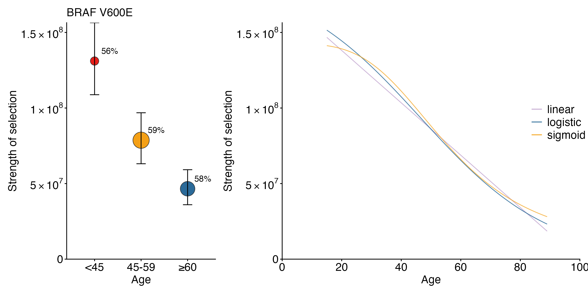
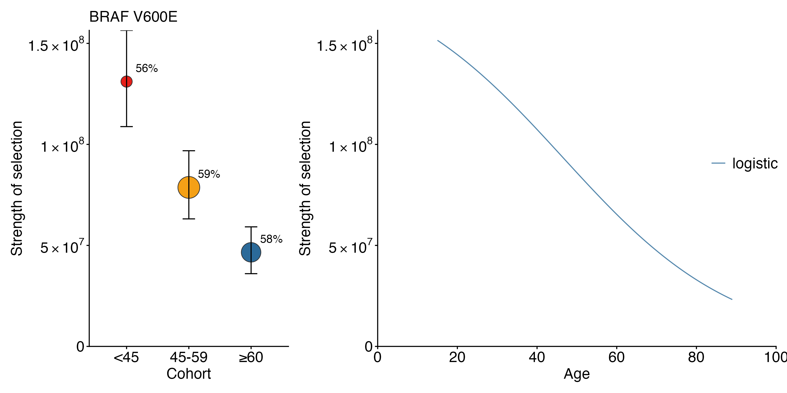

# Continuous covariate selection

## Overview

This tutorial demonstrates continuous-covariate selection inference in
`cancereffectsizeR` using patient age in TCGA thyroid carcinoma (THCA)
as an example.

We first estimate mutation rates and conventional cohort-specific
selection estimates, then fit three continuous models for the strength
of selection:

\text{Linear:}\qquad \gamma(a) = \beta_0 + \beta_1 a,

\text{Logistic:}\qquad \gamma(a) = \frac{\exp(L)} {1 + \exp\[-k(a-m)\]},

and

\text{Generalized sigmoid:}\qquad \gamma(a) = \exp(C) +
\[\exp(L)-\exp(C)\] \frac{a^s}{a^s+m^s}.

The three models have 2, 3, and 4 fitted parameters, respectively. Their
relative fits can therefore be compared using the Akaike Information
Criterion (AIC).

## Load packages

``` r
library(cancereffectsizeR)
library(ces.refset.hg38)
library(data.table)
```

## Load the packaged TCGA-THCA data

The example data are distributed with `cancereffectsizeR` as a frozen,
preprocessed TCGA-THCA data set.

``` r
maf_file <- system.file(
  "continuous_selection_tutorial/TCGA_THCA_age.maf.gz",
  package = "cancereffectsizeR"
)

clinical_file <- system.file(
  "continuous_selection_tutorial/TCGA_THCA_age_clinical.txt",
  package = "cancereffectsizeR"
)

if (maf_file == "" || clinical_file == "") {
  stop("TCGA-THCA tutorial data were not found in the installed package.")
}
```

Load the clinical table.

``` r
TCGA_sample <- fread(clinical_file)
```

The packaged clinical table contains:

``` text
Unique_Patient_Identifier
AGE_AT_SEQ_REPORT
```

Define the three age groups used for the cohort analysis.

``` r
TCGA_sample$Age_Group <- ifelse(
  TCGA_sample$AGE_AT_SEQ_REPORT < 45,
  "<45",
  NA
)

TCGA_sample$Age_Group <- ifelse(
  TCGA_sample$AGE_AT_SEQ_REPORT >= 45 &
    TCGA_sample$AGE_AT_SEQ_REPORT < 60,
  "45-59",
  TCGA_sample$Age_Group
)

TCGA_sample$Age_Group <- ifelse(
  TCGA_sample$AGE_AT_SEQ_REPORT >= 60,
  ">=60",
  TCGA_sample$Age_Group
)

TCGA_sample$Age_Group <- factor(
  TCGA_sample$Age_Group,
  levels = c("<45", "45-59", ">=60")
)

table(TCGA_sample$Age_Group)
```

| Age group | Samples |
|:----------|--------:|
| \<45      |     220 |
| 45-59     |     153 |
| \>=60     |     115 |

Preload the MAF using the hg38 reference set. As in the melanoma
analysis, hidden multinucleotide variants are detected during
preprocessing.

``` r
TCGA_maf <- preload_maf(
  maf = maf_file, refset = "ces.refset.hg38",
  detect_hidden_mnv = TRUE
)
```

## Create the CESAnalysis

Create a new `CESAnalysis`, load the TCGA-THCA whole-exome MAF, and then
add the clinical data.

``` r
cesa <- CESAnalysis(refset = "ces.refset.hg38")
cesa <- load_maf(
  cesa = cesa, maf = TCGA_maf, maf_name = "TCGA_THCA",
  coverage = "exome"
)
cesa <- load_sample_data(cesa, TCGA_sample)
```

## Estimate trinucleotide mutation rates

Estimate sample-specific trinucleotide mutation rates using the COSMIC
v3.4 signature set. For this thyroid carcinoma example, use the
suggested THCA signature exclusions.

``` r
signature_exclusions <- suggest_cosmic_signature_exclusions(cancer_type = "THCA")
cesa <- trinuc_mutation_rates(cesa,
  signature_set = ces.refset.hg38$signatures$COSMIC_v3.4,
  signature_exclusions = signature_exclusions
)
```

## Estimate age-group-specific gene mutation rates

Neutral gene mutation rates are estimated separately in the three age
groups using the THCA covariates.

``` r
sample_1 <- cesa$samples[Age_Group == "<45"]
sample_2 <- cesa$samples[Age_Group == "45-59"]
sample_3 <- cesa$samples[Age_Group == ">=60"]
```

For this tutorial, we use BRAF V600E as an example variant, which is
highly recurrent in TCGA-THCA.

``` r
example_variant_names <- c("BRAF V600E")
example_variant_ids <- cesa$variants[variant_name %in% example_variant_names, variant_id]
variants_to_use <- select_variants(cesa, variant_ids = example_variant_ids)
```

Estimate a neutral gene mutation rate for each age group, followed by
the corresponding cohort-specific selection estimate.

``` r
cesa <- gene_mutation_rates(cesa,
  samples = sample_1,
  covariates = ces.refset.hg38$covariates$THCA
)

cesa <- ces_variant(
  cesa = cesa, variants = variants_to_use,
  samples = sample_1, run_name = "small"
)

cesa <- gene_mutation_rates(cesa,
  samples = sample_2,
  covariates = ces.refset.hg38$covariates$THCA
)

cesa <- ces_variant(
  cesa = cesa, variants = variants_to_use,
  samples = sample_2, run_name = "medium"
)

cesa <- gene_mutation_rates(cesa,
  samples = sample_3,
  covariates = ces.refset.hg38$covariates$THCA
)

cesa <- ces_variant(
  cesa = cesa, variants = variants_to_use,
  samples = sample_3, run_name = "large"
)
```

The three cohort-specific estimates are now available as:

``` r
cesa$selection$small
cesa$selection$medium
cesa$selection$large
```

| Age group | Selection intensity | Lower 95% CI | Upper 95% CI |
|:----------|--------------------:|-------------:|-------------:|
| \<45      |           131096295 |    108802498 |    156442901 |
| 45-59     |            78699047 |     63125854 |     96857877 |
| \>=60     |            46573360 |     36007116 |     59181679 |

## Prepare the continuous covariate

The continuous-model likelihood functions require a `data.table`
containing the sample identifier and a numeric `covariate_value`.

Here the continuous covariate is patient age.

``` r
covariate_data <- cesa$samples[, c("Unique_Patient_Identifier", "AGE_AT_SEQ_REPORT")]
setnames(covariate_data, c("Unique_Patient_Identifier", "covariate_value"))
lik_args <- list(covariate_data = covariate_data)
```

The same interface can be used for other continuous sample-level
covariates by placing their numeric values in `covariate_value`.

### Fit the linear model

Fit

\gamma(a) = \beta_0 + \beta_1 a.

The fitted selection intensity is constrained to remain positive over
the observed covariate range.

``` r
cesa <- ces_variant_linear(
  cesa = cesa,
  variants = variants_to_use,
  model = sswm_age_lik,
  lik_args = lik_args,
  run_name = "linear",
  optimizer = "ISRES"
)
```

The result contains the fitted parameters `beta0` and `beta1` together
with the maximized log-likelihood.

### Fit the logistic model

Fit

\gamma(a) = \frac{\exp(L)} {1 + \exp\[-k(a-m)\]}.

Here `exp(L)` is the upper asymptote, `k` controls the growth or decay
rate, and `m` is the covariate value at the midpoint of the transition.

``` r
cesa <- ces_variant_logistic(
  cesa = cesa,
  variants = variants_to_use,
  model = sswm_age_lik_logistic,
  lik_args = lik_args,
  run_name = "logistic",
  optimizer = "bbmle"
)
```

### Fit the generalized sigmoid model

Fit

\gamma(a) = \exp(C) + \[\exp(L)-\exp(C)\] \frac{a^s}{a^s+m^s}.

Here `exp(C)` and `exp(L)` are the lower and upper asymptotes, `s`
controls the shape of the transition, and `m` is the covariate value at
which the fitted selection intensity is halfway between the two
asymptotes.

``` r
cesa <- ces_variant_sigmoid(
  cesa = cesa,
  variants = variants_to_use,
  model = sswm_age_lik_sigmoid,
  lik_args = lik_args,
  run_name = "sigmoid",
  optimizer = "ISRES"
)
```

### Compare the three models by AIC

For each model,

\mathrm{AIC} = -2\ell\_{\max} + 2p,

where p=2, 3, and 4 for the linear, logistic, and generalized sigmoid
models, respectively.

``` r
aic_results <- data.table(
  model = c("linear", "logistic", "sigmoid"),
  loglikelihood = c(
    cesa$selection$linear[variant_id %in% example_variant_ids, loglikelihood],
    cesa$selection$logistic[variant_id %in% example_variant_ids, loglikelihood],
    cesa$selection$sigmoid[variant_id %in% example_variant_ids, loglikelihood]
  ),
  n_parameters = c(2, 3, 4)
)
aic_results[, AIC := -2 * loglikelihood + 2 * n_parameters]
aic_results[order(AIC)]
```

| Model    | Log-likelihood | Number of parameters |     AIC |
|:---------|---------------:|---------------------:|--------:|
| logistic |       -347.076 |                    3 | 700.153 |
| linear   |       -348.184 |                    2 | 700.367 |
| sigmoid  |       -346.196 |                    4 | 700.392 |

The model with the smallest AIC has the strongest relative support among
the three candidate continuous models for the same variant and samples.

## Plot cohort and continuous estimates together

[`plot_effects_continuous()`](https://townsend-lab-yale.github.io/cancereffectsizeR/reference/plot_effects_continuous.md)
can display the cohort-specific point estimates beside the continuous
fits.

Define the cohort run names and their display labels:

``` r
cohort_runs <- c("<45" = "small", "45-59" = "medium", "\u226560" = "large")
```

To show all three continuous fits:

``` r
p_all <- plot_effects_continuous(
  cesa,
  cohort_run_names = cohort_runs,
  linear_run_name = "linear",
  logistic_run_name = "logistic",
  sigmoid_run_name = "sigmoid",
  variants = "BRAF V600E",
  covariate_col = "AGE_AT_SEQ_REPORT",
  output = "cohort_continuous",
  continuous_models = "all",
  x_title = "Age",
  cohort_x_title = "Age"
)

p_all
```



## Plot the AIC-best continuous model

The plotting function can calculate AIC internally and display only the
best-fitting model.

``` r
p_best <- plot_effects_continuous(
  cesa,
  cohort_run_names = cohort_runs,
  linear_run_name = "linear",
  logistic_run_name = "logistic",
  sigmoid_run_name = "sigmoid",
  variants = "BRAF V600E",
  covariate_col = "AGE_AT_SEQ_REPORT",
  output = "cohort_continuous",
  continuous_models = "best",
  x_title = "Age"
)

p_best

attr(p_best, "best_model")
attr(p_best, "AIC")
```



## Confidence intervals

Code for the likelihood-ratio confidence-region analyses used in the
melanoma age study is available in the [melanoma-age
repository](https://github.com/Townsend-Lab-Yale/melanoma-age),
including the
[`age_melanoma_Step2_continuousmodel_cleaned.R`](https://github.com/Townsend-Lab-Yale/melanoma-age/blob/d28676c06bce02605214ea8bb64ffbd62232c601/scripts/age_melanoma_Step2_continuousmodel_cleaned.R)
analysis script.
