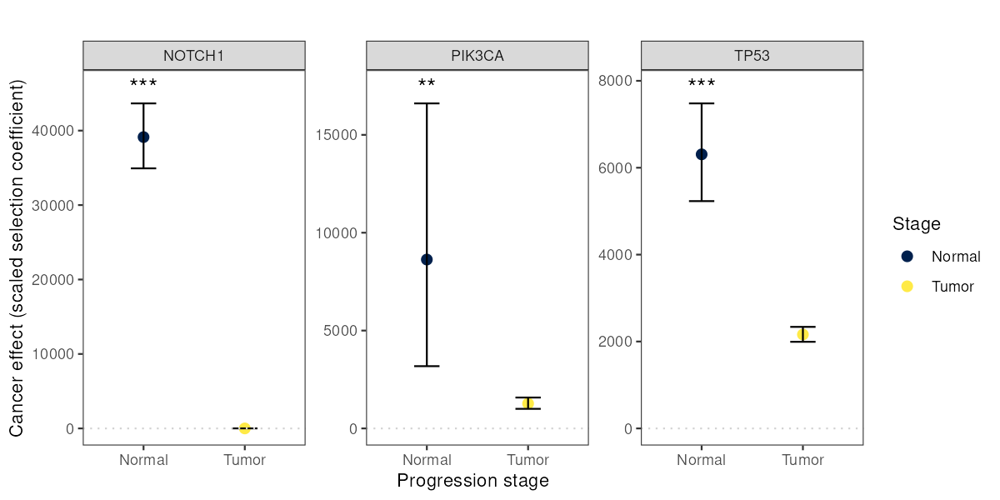

# Step-specific selection

## Introduction

[`ces_variant()`](https://townsend-lab-yale.github.io/cancereffectsizeR/reference/ces_variant.md)
estimates a single scaled selection coefficient for each variant,
assuming selection is constant across every sample included in the
analysis. Sometimes, though, your samples represent an ordered sequence
of tumor progression stages — normal tissue and primary tumor, say, or
primary tumor and metastasis, or more than two stages — and you’d like
to know whether (and how) selection on a variant changes from one stage
to the next.

[`ces_variant_step()`](https://townsend-lab-yale.github.io/cancereffectsizeR/reference/ces_variant_step.md)
and its supporting functions extend cancereffectsizeR to this setting:
instead of one selection intensity per variant, you get one per stage,
estimated jointly from a single likelihood model. This vignette walks
through the workflow: assigning samples to stages, calculating each
gene’s per-stage mutation rate proportions, running the model, testing
whether a step-specific model actually fits better than a plain
[`ces_variant()`](https://townsend-lab-yale.github.io/cancereffectsizeR/reference/ces_variant.md)
run, and plotting the results.

The output shown below comes from an analysis of esophageal squamous
cell carcinoma (ESCC). The `CESAnalysis` holds somatic variants from
normal esophageal epithelium and from primary ESCC tumors, with a
sample-level column, `Pre_or_Pri`, marking each sample as normal
(`"Pre"`) or tumor (`"Pri"`). Results are shown for three genes: NOTCH1,
TP53, and PIK3CA.

This is a substantial modeling exercise, so it’s worth restating the
core assumption plainly: your samples must represent a real, ordered
progression (each later stage having passed through every earlier one),
and each variant you analyze must belong to exactly one gene. If your
samples are better described as independent subgroups (not a
progression), a stratified
[`ces_variant()`](https://townsend-lab-yale.github.io/cancereffectsizeR/reference/ces_variant.md)
analysis (running separately per subgroup) is more appropriate.

## Assigning samples to stages

The first ingredient is a `sample_index` table associating every sample
with an ordered stage.
[`assign_stage_index()`](https://townsend-lab-yale.github.io/cancereffectsizeR/reference/assign_stage_index.md)
builds it from a sample-level metadata column (added via
[`load_maf()`](https://townsend-lab-yale.github.io/cancereffectsizeR/reference/load_maf.md)
or
[`load_sample_data()`](https://townsend-lab-yale.github.io/cancereffectsizeR/reference/load_sample_data.md))
and a description of stage order:

``` r
sample_index <- assign_stage_index(cesa, stage_col = "Pre_or_Pri", stage_order = c("Pre", "Pri"))
```

`stage_order` just needs to be in earliest-to-latest order. For more
than two stages, or when multiple raw values should be grouped into the
same stage, use a named list instead:

``` r
sample_index <- assign_stage_index(cesa,
  stage_col = "tissue_type",
  stage_order = list(
    Normal = "Normal",
    Primary = "Primary_tumor",
    Metastasis = c("Lymph_node_met", "Distant_met")
  )
)
```

If you already have a table associating samples with stages, you can
build `sample_index` by hand instead: it just needs
`Unique_Patient_Identifier`, `group_index` (1 = earliest stage), and
`group_name` columns.

## Calculating stage-specific mutation rate proportions

The model also needs, for each gene, what proportion of its total
mutation rate is estimated to accumulate during each stage. This comes
from running
[`gene_mutation_rates()`](https://townsend-lab-yale.github.io/cancereffectsizeR/reference/gene_mutation_rates.md)
once per stage, each time restricted to the samples at that stage.
Because samples at a later stage have passed through every earlier stage
first, each stage’s rate is a cumulative total:

``` r
cesa <- gene_mutation_rates(cesa,
  covariates = "ESCA", save_all_dndscv_output = TRUE,
  samples = cesa$samples[Pre_or_Pri == "Pre"]
)
cesa <- gene_mutation_rates(cesa,
  covariates = "ESCA", save_all_dndscv_output = TRUE,
  samples = cesa$samples[Pre_or_Pri == "Pri"]
)
```

Each call creates a new gene rate group (`rate_grp_1`, `rate_grp_2`, …).
[`stage_mutation_proportions()`](https://townsend-lab-yale.github.io/cancereffectsizeR/reference/stage_mutation_proportions.md)
converts the cumulative, per-stage rates into per-gene proportions:

``` r
stage_mut_prop <- stage_mutation_proportions(cesa,
  rate_cols = c("rate_grp_1", "rate_grp_2"),
  stage_names = c("Pre", "Pri")
)
```

``` r
stage_mut_prop
```

    ##      gene       p_Pre     p_Pri     rate_Pre     rate_Pri
    ##    <char>       <num>     <num>        <num>        <num>
    ## 1: NOTCH1 0.008622453 0.9913775 1.574028e-08 1.825500e-06
    ## 2: PIK3CA 0.024357783 0.9756422 2.193040e-08 9.003448e-07
    ## 3:   TP53 0.084339892 0.9156601 8.944523e-08 1.060533e-06

The `p_<stage>` columns are the proportions, and the `rate_<stage>`
columns are the cumulative rates they were calculated from.

By default, these are uncorrected rates: each gene’s expected synonymous
mutation count from dNdScv’s covariate model, divided by its number of
synonymous sites and by the number of samples. This requires
`save_all_dndscv_output = TRUE` in each
[`gene_mutation_rates()`](https://townsend-lab-yale.github.io/cancereffectsizeR/reference/gene_mutation_rates.md)
call. The rates that
[`gene_mutation_rates()`](https://townsend-lab-yale.github.io/cancereffectsizeR/reference/gene_mutation_rates.md)
assigns for
[`ces_variant()`](https://townsend-lab-yale.github.io/cancereffectsizeR/reference/ces_variant.md)
are instead adjusted toward each gene’s observed synonymous mutation
count. That adjustment is skipped whenever dNdScv’s overdispersion
parameter (theta) is below 1, which is common for sparse early-stage
samples, so using uncorrected rates at every stage keeps the stage
proportions internally consistent. To use the rates in
`get_gene_rates(cesa)` as they are instead, set
`rate_source = "gene_rates"`.

Cumulative rates should never decrease from one stage to the next (a
later stage covers at least as much mutational time as an earlier one),
but dN/dS-based rate estimates are noisy, and a small number of genes
can come out non-monotonic just from that noise. By default
(`on_invalid = "floor"`), affected genes get a warning and have their
negative/undefined stage contribution floored to a tiny share
(`floor_prop`, default 1e-6) of the gene’s total rate, with proportions
rescaled to still sum to 1. Set `on_invalid = "NA"` to instead leave
those genes’ rows as `NA` (so you can decide how to handle them, or drop
them from `variants` before running
[`ces_variant_step()`](https://townsend-lab-yale.github.io/cancereffectsizeR/reference/ces_variant_step.md)),
or `on_invalid = "error"` to stop and inspect them yourself.

## Setting mutation rates for the model

The step-specific model starts from each gene’s total (final-stage,
cumulative) mutation rate and divides it among stages using
`stage_mut_prop`. So before running it, replace the per-stage rates with
the final-stage cumulative rate for every sample:

``` r
cesa <- clear_gene_rates(cesa)
cesa <- set_gene_rates(cesa,
  rates = stage_mut_prop[, .(gene, rate = rate_Pri)],
  missing_genes_take_nearest = TRUE
)
```

[`ces_variant_step()`](https://townsend-lab-yale.github.io/cancereffectsizeR/reference/ces_variant_step.md)
warns if the included samples still belong to more than one gene rate
group.

## Running the model

With `sample_index` and `stage_mut_prop` in hand,
[`ces_variant_step()`](https://townsend-lab-yale.github.io/cancereffectsizeR/reference/ces_variant_step.md)
works much like
[`ces_variant()`](https://townsend-lab-yale.github.io/cancereffectsizeR/reference/ces_variant.md):

``` r
# One compound variant per gene, to estimate gene-level effects (see define_compound_variants()).
# The output shown used a curated set of recurrent and nonsense variants for each gene.
for_comp <- select_variants(cesa, genes = c("NOTCH1", "TP53", "PIK3CA"), min_freq = 2)
gene_variants <- define_compound_variants(cesa,
  variant_table = for_comp, by = "gene",
  merge_distance = Inf
)
cesa <- ces_variant_step(cesa,
  variants = gene_variants, stage_mut_prop = stage_mut_prop,
  sample_index = sample_index, run_name = "step_effects",
  return_fit = TRUE, conf = 0.95
)
```

(You can pass `stage_col`/`stage_order` directly to
[`ces_variant_step()`](https://townsend-lab-yale.github.io/cancereffectsizeR/reference/ces_variant_step.md)
instead of a pre-built `sample_index`, exactly as with
[`assign_stage_index()`](https://townsend-lab-yale.github.io/cancereffectsizeR/reference/assign_stage_index.md).)

The output table has one selection intensity column per stage
(`si_<stage name>`), and, when `conf` is set, matching confidence
interval columns. It also reports the fit of a constrained model in
which all stages share one selection intensity
(`selection_intensity_constant`, `loglikelihood_constant`):

``` r
step_effects
```

    ##    variant_name variant_type    si_Pre   si_Pri loglikelihood
    ##          <char>       <char>     <num>    <num>         <num>
    ## 1:         TP53     compound  6307.780 2161.572    -1376.0627
    ## 2:       NOTCH1     compound 39131.538    0.001     -886.8897
    ## 3:       PIK3CA     compound  8628.349 1271.119     -397.7721
    ##    selection_intensity_constant loglikelihood_constant ci_low_95_si_Pre
    ##                           <num>                  <num>            <num>
    ## 1:                    2626.6268             -1399.5434         5231.543
    ## 2:                     406.2518             -1699.0672        34931.784
    ## 3:                    1497.3475              -401.5242         3180.976
    ##    ci_high_95_si_Pre ci_low_95_si_Pri ci_high_95_si_Pri num_snv
    ##                <num>            <num>             <num>   <int>
    ## 1:          7480.451         1993.673       2337.148693     273
    ## 2:         43655.842               NA          4.991894     204
    ## 3:         16607.331         1000.922       1578.646337      15
    ##                    shared_cov shared_cov_freq total_freq
    ##                        <list>           <int>      <int>
    ## 1: exome+,mart,ucla,yoko,yuan            1130       1130
    ## 2: exome+,mart,ucla,yoko,yuan             310        310
    ## 3: exome+,mart,ucla,yoko,yuan             106        106
    ##    shared_cov_subvariant_freq total_subvariant_freq held_out
    ##                         <int>                 <int>    <num>
    ## 1:                       1252                  1252        0
    ## 2:                        401                   401        0
    ## 3:                        107                   107        0

Every variant (or compound variant) passed to
[`ces_variant_step()`](https://townsend-lab-yale.github.io/cancereffectsizeR/reference/ces_variant_step.md)
must map to exactly one gene present in `stage_mut_prop` — the
mutation-rate proportions are gene-level, so an intergenic variant or a
compound spanning multiple genes has no single row to use.

## Is the step-specific model actually better?

The step-specific model always fits at least as well as the constrained
model with one shared selection intensity, because it has more free
parameters (one per stage, instead of one overall). To see whether the
improvement is more than you’d expect by chance, compare the two with a
likelihood ratio test:

``` r
lrt <- step_selection_LRT(cesa, step_run_name = "step_effects")
```

Both models use the same likelihood and the same mutation rates, so they
are nested, as a likelihood ratio test requires. (A plain
[`ces_variant()`](https://townsend-lab-yale.github.io/cancereffectsizeR/reference/ces_variant.md)
run on the same `cesa` is *not* nested in the step-specific model,
because every sample carries the final-stage rate.
[`step_selection_LRT()`](https://townsend-lab-yale.github.io/cancereffectsizeR/reference/step_selection_LRT.md)
accepts one via `simple_run_name`, but only use this when each sample’s
rate is the cumulative rate for its own stage.)

``` r
lrt
```

    ##    variant_name loglik_step loglik_simple    df    LRT_stat      p_value
    ##          <char>       <num>         <num> <num>       <num>        <num>
    ## 1:         TP53  -1376.0627    -1399.5434     1   46.961339 7.240088e-12
    ## 2:       NOTCH1   -886.8897    -1699.0672     1 1624.354970 0.000000e+00
    ## 3:       PIK3CA   -397.7721     -401.5242     1    7.504238 6.155399e-03

## Plotting results

[`plot_effects_step()`](https://townsend-lab-yale.github.io/cancereffectsizeR/reference/plot_effects_step.md)
visualizes step-specific effects, with one panel per variant (or gene,
or any other grouping column), stage on the x-axis, and points colored
by stage. It works for any number of stages. Passing the
[`step_selection_LRT()`](https://townsend-lab-yale.github.io/cancereffectsizeR/reference/step_selection_LRT.md)
output via `lrt` adds a significance annotation to each panel.

``` r
plot_effects_step(step_effects,
  group_by = "variant_name", lrt = lrt,
  stage_order = c("Pre", "Pri"), stage_labels = c(Pre = "Normal", Pri = "Tumor")
)
```



Note that a confidence limit comes out `NA` when it would fall outside
the optimizer’s bounds (by default, 0.001 to 1e9). This is common for
the lower limit when an estimate is at or near the 0.001 floor (for
example, NOTCH1’s tumor-stage estimate above).
[`plot_effects_step()`](https://townsend-lab-yale.github.io/cancereffectsizeR/reference/plot_effects_step.md)
simply omits that side of the error bar.
